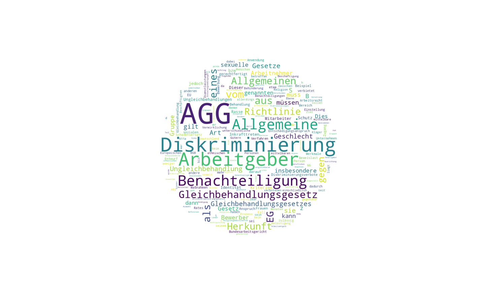
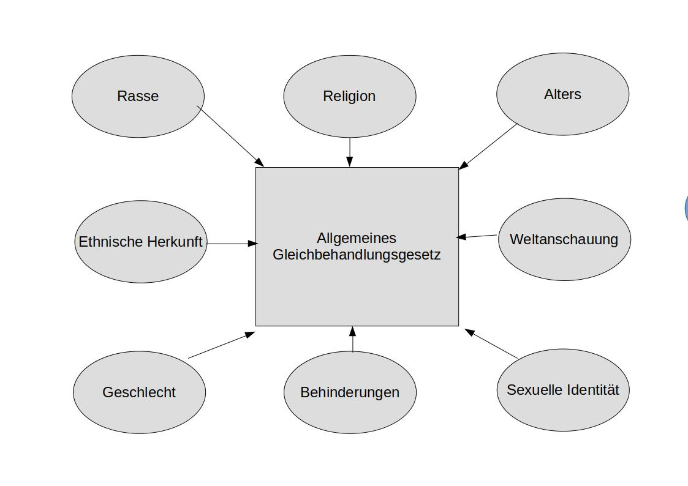
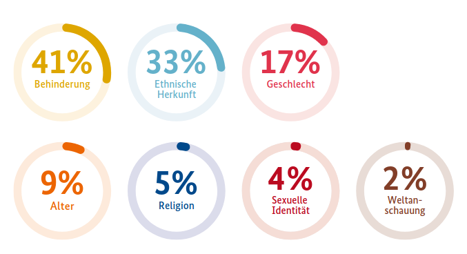
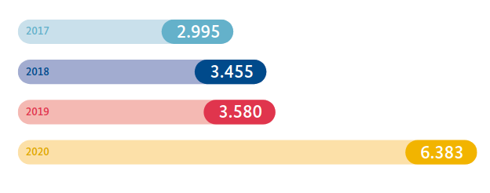
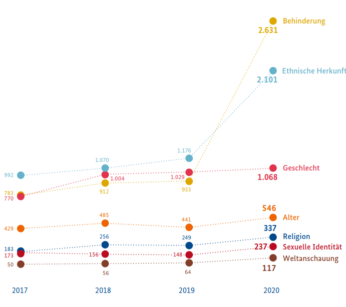
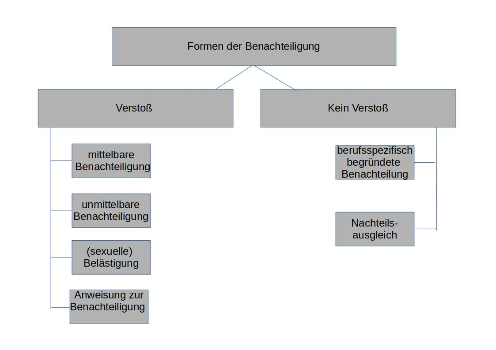

```{r setup, include=FALSE}
knitr::opts_chunk$set(echo = FALSE)
```


# Rechtliche Grundlagen




## Hintergrund

Ein allgemeines Benachteiligungsverbot wird Bürgern der Bundesrepublik seit 1949 durch Art.3. Abs.3 des Grundgesetzes garantiert:

> "Niemand darf wegen seines Geschlechtes, seiner Abstammung, seiner Rasse, seiner Sprache, seiner Heimat und Herkunft, seines Glaubens, seiner religiösen oder politischen Anschauungen benachteiligt oder bevorzugt werden. Niemand darf wegen seiner Behinderung benachteiligt werden." [@gg, Paragraph 3, Abs. 3]

Zahlreiche weitere Reglungen zum Grundsatz der Gleichbehandlung existieren u.a. in den folgenden Gesetzen:

-   BGB
-   BetrVG
-   Sozialgesetzbuch
-   ArbGG


## Erlassung allgemeines Gleichbehandlungsgesetzes

-   Das AGG wird im Jahre 2006 erlassen

-   Zielsetzung: Grundsatz der Gleichbehandlung und Bekämpfung von Diskriminierung soll einheitlich und im Einklang mit europäischen Richtlinien reguliert werden

-   Rechtsfolgen aus dem Gesetzt für multiple Rechtsgebiete:

    1.  **Arbeitsrecht**
    2.  Zivilrecht
    3.  Soldatenrecht
    4.  Sozialrecht

[@main, Seite 17]


## Geschützter Personenkreis

Das AGG schützt im arbeitsrechtlichen Kontext einen sehr weiten Kreis von Personen, insbesondere:

1.  Arbeitnehmer/-innen (abhängige Beschäftigungsverhältnisse)
2.  Auszubildende
3.  Arbeitnehmerähnliche Personen (wirtschaftlich unselbstständige)

*Zusätzlich werden auch Bewerber/-innen und ehemalige Beschäftigte in den Kreis der geschützten Personen einbezogen*

[@agg, Paragraph 6, Abs 1]


## Überblick Geltungsbereich

{width=75%, height=75%}


## Geschützte Charakteristika

Gesetztesziel: Verhinderung und Beseitigung von (arbeitsrechtlichen) Benachteiligungen aufgrund der folgenden Charakteristika:

-   Rasse,
-   ethnischer Herkunft,
-   Geschlechts,
-   Religion,
-   Weltanschauung,
-   Behinderungen.
-   Alters,
-   sexuellen Identität

*Schützenswert sind die Charakteristika, die von einer Person nicht beeinflusst werden können (Ausnahme Religion/ Weltanschauung, diese sind jedoch durch das Grundgesetz geschützt)*

[@agg, Paragraph 1]


# Zahlen und Statistiken

## Überblick Merkmalsverteilung

{width=40%, height=40%}

[@jb2020, Seite 44]


## Überblick jährlicher Beratungsanfragen


{width=40%, height=40%}

[@jb2020, Seite 43]


## Entwicklung jährlicher Beratungsanfragen


{width=60%, height=50%}

[@jb2020, Seite 45]

# Formen der Benachteiligung

## Überblick Benachteiligungen

{width=75%, height=75%}


## Formen der Benachteiligung (2/3)

### Unmittelbare Benachteiligung
  
Die benachteiligte Person erfährt eine weniger günstige Behandlung im **Vergleich** zu anderen Personen. [@agg, Paragraph 3, Satz 1]


### Mittelbare Benachteiligung
  
Vorschriften, Kriterien oder Verfahren **könnten** eine Person benachteiligen [@agg, Paragraph 3, Satz 2]\  


**Notwendige Bedingung**: Benachteiligung aufgrund eines oder mehreren der geschützten Charakteristika aus Paragraph 1 auftreten.


## Formen der Benachteiligung (3/3) -

### Benachteiligung durch Belästigungen und/oder sexuelle Belästigung

Unerwünschte Verhaltensweisen, die potentiell die Würde des Empfängers verletzten könnten [@agg, Paragraph 3, Satz 3,4] - 

### Anweisungen zur Benachteiligung

Die Abgabe von Anweisungen, die eine Benachteiligung einer Person nach sich ziehen könnte (mittelbar oder unmittelbar), werden gleichgestellt direkten Ausführung einer solchen Benachteiligung [@agg, Paragraph 3, Satz 5]


## Zulässige Benachteiligung

In bestimmten Fällen, ist es für Arbeitgeber zulässig, Personen aufgrund von geschützten Charakteristika zu benachteiligen:

### Spezifische berufliche Anforderungen

Für die Ausübung einer spezifischen beruflichen Tätigkeit, stellen die geschützten Charakteristika ein wesentliches Hindernis dar [@agg, Paragraph 8]

- Bsp.: Altersgrenzen bei der Einstellung von Feuerwehrsleuten
- Bsp.: Körperliche Belastbarkeit in Handwerksberufen

### Nachteilsausgleichende Maßnahmen

Gezielten Förderung von benachteiligten Gruppe [@agg, Paragraph 5]

- Bsp.: Bevorzugte Einstellung von Schwerbehinderten
- Bsp.: Frauenförderung


# Fallbeispiel

### Fall 1 

Ein katholischer Bewerber wird im Auswahlverfahren um die Stelle für die Leitung eines jüdischen Museums aufgrund seiner Religionszugehörigkeit abgelehnt.

### Fall 2 

Eine Bewerberin mit Legasthenie wird bei der Auswahl für eine Lektoratsstelle aufgrund ihrer Einschränkung ausgeschlossen.\  

*Ihre Einschätzung: Zulässig oder Verstoß gegen das AGG ?*


# Arbeitsrechtliche Umsetzung


## Unternehmerische Konsequenzen

Bewerber/-Innen und Mitarbeiter/-Innen können Schadensansprüche gegen Organisation geltend machen, sofern Sie eine Ungleichbehandlung nachweisen können.[@agg, Paragraph 15]

- Ein üblicher Schadensersatzanspruch beläuft sich auf ca. 3 Bruttogehälter der angestrebten Stelle

*Zusätzliche Gefahr des "AGG Hoppings", systematische Verwertung von AGG Verstößen durch Schadensersatzansprüche*


## Rechenbeispiel

100 Bewerber/-Innen bewerben sich auf eine Stellenanzeige mit einem Frauen-benachteiligendem Ausschreibungstext. Das monatliche Bruttogehalt für die Stelle beläuft sich auf 3000€.

Potentielle Schadensersatzzahlungen bei Klage von 50 Bewerberinnen:

```{r schadensersatz, echo=TRUE, comment='=='}
(3000 * 3) * 50
```

*Zusätzlich können nicht unerhebliche Kosten für die rechtliche Vertretung auf das Unternehmen zukommen*


## Vorbeugende Maßnahmen und Pflichten des AG

Generalklausel: Arbeitgeber sollen durch geeignete Maßnahmen, beispielsweise Aus- und Fortbildung, der Ungleichbehandlung von geschützen Personen entgegenwirken [@agg, Paragraph 12, Abs.1]

**Es besteht eine Pflicht für den AG entsprechende Maßnahmen umzusetzen!**

Präventive Maßnahmen umfassen z.B.:
  
  * Diversity Training
  * Rechtliche Schulungen
  * Sensibilisierungstrainings (z.B. gegen Mobbing)

Informationsmaßnahmen:
  
  * Aushang des Gesetzestexts
  * AGG konforme Leitfäden
  * Ansprechpartner im Unternehmen


## Auswirkungen auf die Personalbeschaffung

Um arbeitsrechtliche Verstöße zu vermeiden, müssen Unternehmen ihre Personalbeschaffungsmaßnahmen AGG konform implementieren. Kritisch sind insbesondere zwei Bereiche der Personalbeschaffung:

- **Personalwerbung**: An die gewünschten Bewerber/-Innen gerichtete Informations-, Kommunikations- und Aktivierungsmaßnahmen
- **Personalauswahl**: Analyse und Auswahl von Bewerber/-Innen anhand ihres Eignungspotentials für das Unternehmen

[@woehe, Seite 129]


## Personalwerbung - Stellenausschreibungen

Die Ausschreibung von Stellen, sowohl intern als auch extern, muss sorgfältig formuliert werden um nicht gegen das AGG zu verstoßen


## Geschlechtsneutrale Formulierung

**Empfehlenswerte Vorgehensweisen**:
  
- ausschließlich Funktionsbezeichnugen nennen, z.B. Abteilungsleitung
- explizite Nennung von Männlich/Weiblich/Divers
- juristische Expertise einholen

**Exemplarische Verstöße**:

- Ausschreibung einer Stelle als Krankenschwester
- Stellenbezeichnung im generisches Maskulinum, z.B. "Abteilungsleiter gesucht"
  
Selbst scheinbar harmlose Formulierungen, wie "Vollzeitstelle" oder "Körperliche Belastbarkeit vorausgesetzt" können und wurden bereits als Verstöße gegen das AGG kategorisiert.

[@ihk_wsb]


## Altersdiskriminierunde Formulierungen

Formulierungen können sowohl jüngere als auch ältere Bewerber benachteiligen:

- "Unser junges und dynamisches Team sucht Verstärkung"
- "Langjährige Berufserfahrung wird vorausgesetzt"

Altersgrenzen müssen vermieden werden, wenn diese nicht aus besonderen beruflichen Gründen gerechtfertigt sind.

[@ihk_wsb]


## Weitere diskriminierende Formulierungen

Zahlreiche weitere Formulierungen können gegen das AGG verstoßen

- "körperlich uneingeschränkt leistungsfähiger Vetriebsleiter gesucht" 
  - Diskriminierung von körperlich behinderten Bewerbern
- "Englischer Muttersprachler für unser Dolmetscherbüro gesucht"
  - Diskriminierung von Menschen anderer Herkunft
[@ihk_wsb]


## Personalauswahl

* Bei der Auswahl von Kandidaten aus dem Bewerberpool müssen Unternehmen ebenfalls darauf achten keine Verstöße gegen das AGG zu begehen.

* Empfehlungen:

  - Klare Definition von (nicht diskriminierenden) Auswahlkriterien
  - Transparentes und nachvollziehbares Verfahren
  - Lückenlose Dokumentation des Prozesses

[@ihk_wsb]


## Auswahlkriterien

Das Festlegen von nicht-diskriminierenden Auswahlkriterien ist Grundlage einer AGG konformen Personalauswahl:

  * berufliche Qualifikationen
  * Aus- und Weiterbildungsstatus
  * Sprach- oder EDV Kenntnisse

AGG Verstöße drohen hingegen bei Ausschluss von Bewerben aufgrund von:
  
  * fehlendem Bewerbungsfoto
  * fehlender Angabe des Geburtsdatums
  * unvollständiger Angabe des Namens (z.B. nur Vorname angegeben)
  * Vorhandensein von Kindern
  
[@ihk_wsb]


## Dokumentationsempfehlungen (1/3)

Falls das Unternehmen beschuldigt wird, einen Bewerber ungleich behandelt zu haben, muss das Unternehmen diese Beschuldigung aktiv widerlegen.

Als wichtigste Verteidigungslinie gilt die lückenlose Dokumentation aller Phasen und Entscheidungen der Personalauswahl.

Anmerkung: Die umfassende Dokumentation und Aufbewahrung ist rechtlich nicht verpflichtend vorgeschrieben.


## Dokumentationsempfehlung (2/3)

Die Dokumentation sollte folgende Punkte umfassen:

1. Nach welchen Kriterien wurden eingehende Bewerbungen evaluiert?
2. Archivierung von Kopien aller eingegangenen Bewerbungen (potentielle Beweismittel)[^1]
3. Protokollierung von Bewerbungsgesprächen

Anmerkung: Bewerber müssen ihre Ansprüche bei AGG Verstößen innerhalb einer Frist von 2 Monaten geltend machen. Für Bewerbungsunterlagen gelten daher vergleichsweise kurze Aufbewahrungszeiten.

[^1]:Orginale dürfen nach der Ablehung des Bewerbers nicht archiviert werden.


## Dokumentationsempfehlung (3/3)

**Besondere sorgfältige Dokumentation muss bei dem Ausschluss von Bewerbern aus dem Auswahlverfahren erfolgen**:

* Auf welcher Entscheidungsgrundlage ist der Teilnehmer ausgeschlossen worden?
* In welcher Phase des Verfahrens ist der Teilnehmer ausgeschlossen worden?

[@ihk_wsb]


## Take Home Message

  1. Das AGG schützt im arbeitsrechtlichen Kontext Arbeitnehmer, Auftragsnehmer, Auszubildenden sowie Bewerber und ehemalige Beschäftigte
  2. Durch das AGG geschützte Merkmale umfassen: Rasse, ethnischer Herkunft, Geschlecht, sexuelle Identität, Religion, Weltanschauung, Alter und Behinderungen.
  3. Verstöße gegen das AGG können sowohl mittelbar als auch unmittelbar geschehen
  4. Ungleichbehandlungen sind zulässig, sofern Sie beruflich gerechtfertig sind oder dem Nachteilsausgleich dienen
  5. Personalwerbung: Starke Sorgfalt und juristische / personalpolitische Expertise bei der Formulierung
  6. Personalauswahl: Lückenlose Dokumentation als rechtlicher Schutz gegen Anschuldigungen


# Literaturverzeichnis
