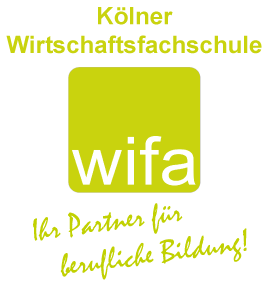

```{r setup, include=FALSE}
knitr::opts_chunk$set(echo = FALSE)
```


# Unternehmensvorstellung



## Eckdaten 

* A
* B
* C


## Geschäftsbereiche

1. 1
2. 2
3. 3


## Aufbauorganisation

* 0
* 1
* 2


# Betriebliche Handlungsalternativen


## Ökonomische Zielkonflikte

was ist daaas?

# Literaturverzeichnis
